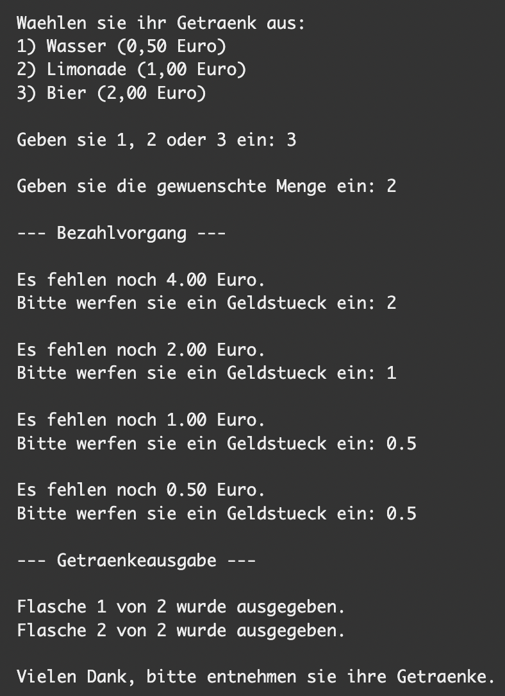

# Namespaces und Klassen

## Klassen

1. Erstelle eine neue Konsolenanwendung. Definiere eine Klasse mit dem Namen **Animal** ohne Methoden oder Eigenschaften und deklariere eine Instanz Ihrer Klasse **Animal**, die einer Variablen mit dem Namen **dog** zugewiesen ist.

2. Füge eine Methode namens `Speak` zur Klasse `Animal` hinzu. Die Methode sollte Folgendes enthalten: `Console.WriteLine("Der Hund sagt wuff!");`. Die Methode sollte nichts zurückgeben.

3. Füge eine **String**-Eigenschaft mit dem Namen **Sound** zur Klasse hinzu.

4. Füge einen **Konstruktor** zur Klasse `Animal` hinzu. Der Konstruktor sollte einen String-Parameter namens **sound** übergeben.

5. Füge die Eigenschaft **DateOfBirth** zur Klasse `Animal` hinzu. Die Eigenschaft sollte vom Typ `DateTime` sein und im Konstruktor optional übergeben werden. Wenn sie nicht übergeben wird, wird das heutige Datum gesetzt. Die Eigenschaft darf nur vom Konstruktor gesetzt werden.

6. Fügen eine Methode namens `GetAge` hinzu, die den Inhalt hat: `return DateTime.Now.Year - DateOfBirth.Year;`

## Namespaces

1. Erstelle eine neue Konsolenanwendung und lege für die `Main` Methode einen Namspace fest (dein Firmenname).

    Erzeuge nun zwei weitere Namespaces (in der gleichen oder speraten Datei), die je zwei Domains aus deinem Unternehmen wiederspiegeln (z.B. `GrossWeber.Trainings` und `GrossWeber.Trainings.Management`).

    Erstelle zwei oder mehrere Klassen (z.B. `Trainer`, `Course`) mit Eigenschaften (z.B. `Title` oder `Name`) in einen der Namespaces und eine weitere Klasse mit Funktionalität (z.B. `BookingTrainer`) in dem anderen Namespace.

    Nutze die erstellten Klassen und Funktionen in der `Main` Methode, in dem du den **vollqualifizierten Namen** verwendest.

2. Erstelle für die Klasse aus Aufgabe 1 einen Alias und verwende diesen, um ein Objekt dieser Klasse zu erzeugen.

3. Verwende zum Erstellen des Klassenobjekts aus Aufgabe 1 die `using`-Anweisung. Rufe im Anweisungsblock dieser Anweisung die Methode der Klasse auf.

## Das ferngesteuerte Auto

In dieser Übung programmierst du ein ferngesteuertes Auto.

Das Auto startet mit 100% Batterie. Jedes mal, wenn das Auto mit der Fernbedienung bewegt wird, legt es 20 Meter zurück und verbraucht 1% Batterie. 

Das Auto kann auf einen LED Display folgende Informationen anzeigen:
- Die zurückgelegte Gesamtstrecke, angezeigt als: "Gefahrene Meter: <METERS>m".
- Die verbleibende Akkuladung, angezeigt als: "Batterieladung: <PERCENTAGE>%".

Wenn die Batterie bei **0 %** ist, kann das Auto nicht mehr fahren und die Batterieanzeige zeigt an "Batterie leer".

1. Kaufe ein neues ferngesteuertes Auto 🚘

    Implementiere die (statische) `RemoteControlCar.Buy()`Methode, um eine neues ferngesteuerte Autoinstanz zurückzugeben:

    ```csharp
    RemoteControlCar car = RemoteControlCar.Buy();
    ```

2. Zeige die gefahrene Strecke an

    Implementiere die `RemoteControlCar.DistanceDisplay()`Methode, um die Entfernung wie auf dem LED-Display angezeigt zurückzugeben:

    ```csharp
    var car = RemoteControlCar.Buy();
    car.DistanceDisplay();
    // => "Gefahrene Meter: 0 m"
    ```

3. Zeige den Batterieprozentsatz an

    Implementiere die `RemoteControlCar.BatteryDisplay()`Methode, um den Batterieprozentsatz wie auf der LED-Anzeige angezeigt zurückzugeben:

    ```csharp
    var car = RemoteControlCar.Buy();
    car.BatteryDisplay();
    // => "Batterieladung: 100%"
    ```

4. Aktualisiere die Anzahl der beim Fahren gefahrenen Meter

    Implementiere die `RemoteControlCar.Drive()`Methode, die die Anzahl der gefahrenen Meter aktualisiert:

    ```csharp
    var car = RemoteControlCar.Buy();
    car.Drive();
    car.Drive();
    car.DistanceDisplay();
    // => "Gefahrene Meter: 40 m"
    ```

5. Aktualisiere den Batterieprozentsatz während der Fahrt

    Aktualisiere die `RemoteControlCar.Drive()`Methode, um den Batterieprozentsatz zu aktualisieren:

    ```csharp
    var car = RemoteControlCar.Buy();
    car.Drive();
    car.Drive();
    car.BatteryDisplay();
    // => "Batterieladung: 98%"
    ```

6. Verhindere das Fahren, wenn die Batterie entladen ist

    Aktualisiere die `RemoteControlCar.Drive()`Methode, um die gefahrene Strecke nicht zu erhöhen oder den Batterieprozentsatz zu verringern, wenn die Batterie leer ist (bei 0 %):

    ```csharp
    var car = RemoteControlCar.Buy();

    // Drain the battery
    // ...

    car.DistanceDisplay();
    // => "Driven 2000 meters"

    car.BatteryDisplay();
    // => "Battery empty"
    ```

## Der Getränkeautomat

Wir erweitern unseren Getränkeautomat um etwas mehr Funktionalität und nutzen dabei unser Wissen über Klassen und Methoden:

1. Nach der Wahl der Sorte kann der Benutzer auch eine Menge eingeben. Der zu zahlende Betrag errechnet sich dann aus dem Produkt von Menge und Preis pro Flasche. Die Ausgabe der einzelnen Flaschen erfolgt mit einer Bildschirmausgabe, siehe unten.

2. Die Bezahlung soll jetzt auch mit verschiedenen Geldstücken gemacht werden können. Der Benutzer wird solange aufgefordert Geld einzuwerfen, bis der zu zahlende Betrag erreicht ist.

3. Fasse alle Aktionen in Funktionen zusammen, sodass das Hauptprogramm weitgehend aus Funktionsaufrufen besteht.

4. Entwickle eine neue Funktion, welche das eingeworfene Geldstück überprüft. Gültige Geldstücke sind **0.05, 0.10, 0.20, 0.50, 1.0 und 2.0 Euro**. Ist das Geldstück nicht gültig, wird eine Meldung ausgegeben und der Betrag nicht vom zu zahlenden Betrag abgezogen. Die Funktion gibt also nur den Wert wahr oder falsch zurück. Dies kann mit den Rückgabetype boolena (`true`/`false`) erreicht werden.

5. Modifiziere den **Bezahlvorgang** derart, dass man diesen jederzeit mit der Eingabe von **0** abbrechen kann. Dem Benutzer wird dann sein bisher eingeworfenes Geld zurückgegeben – simuliert durch eine Bildschirmausgabe mit dem jeweiligen Betrag.

    

## Ressourcen

[Klassen](https://docs.microsoft.com/de-de/dotnet/csharp/programming-guide/classes-and-structs/classes)

[Eigenschaften](https://docs.microsoft.com/de-de/dotnet/csharp/programming-guide/classes-and-structs/properties)

[Konstruktor](https://docs.microsoft.com/de-de/dotnet/csharp/programming-guide/classes-and-structs/constructors)

[DateTime](https://learn.microsoft.com/de-de/dotnet/api/system.datetime?view=net-6.0)

